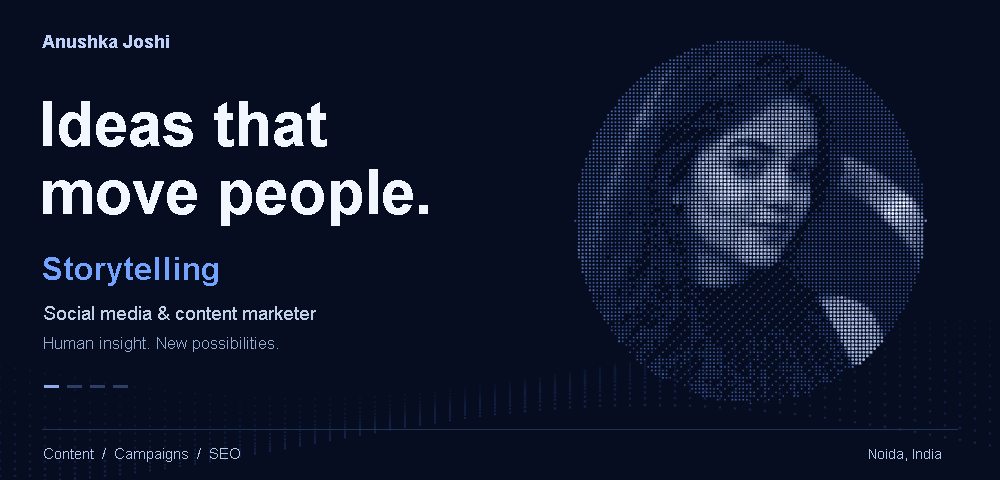

<a href="https://anushkamarketing.github.io/AnushkaMarketing/">
<picture>
  <source media="(prefers-reduced-motion: reduce)" srcset="assets/particle-portrait-no-orbits-v3.png" />
  
</picture>
</a>

<a href="https://anushkamarketing.github.io/AnushkaMarketing/">Explore the interactive particle canvas</a>

<a href="https://anushka-joshi.netlify.app/">Read my portfolio</a> &nbsp; / &nbsp; <a href="https://www.linkedin.com/in/anushkamjoshi/">LinkedIn</a> &nbsp; / &nbsp; <a href="https://www.instagram.com/anushkamjoshi/">Instagram</a>

## I make content worth pausing for.

I’m **Anushka Joshi**, a social media and content marketer based in Noida. I work
across B2B storytelling, social campaigns, short-form video and SEO — connecting
the idea, the words and the way a story reaches people.

This is my corner for exploring the tools behind that work: clearer research,
better content workflows and ideas that make marketing more useful.

### Currently on my desk

**Cognitute · Social Media Marketing Executive**  
B2B social content, LinkedIn storytelling, content calendars, carousels and reporting.

**Previously: Woost Internet · Content & Offer Executive**  
June 2023 – February 2026 · Promotional copy, social content, short-form videos and SEO.

### The departments

| Content & story | Social & campaigns | Search & insight |
| :--- | :--- | :--- |
| Copywriting, articles, scripts | LinkedIn, Instagram, content calendars | SEO, GA4, Search Console |
| Brand voice and B2B communication | Reels, community and campaign support | Research and performance reporting |

**Tools I work with:** Canva · Meta Business Suite · Google Analytics 4 · Google
Search Console · WordPress · Excel.

### Project spotlight · Omniscope

A self-hosted marketing intelligence workbench for creator and website research.
Omniscope connects discovery, evidence and reports, keeping observed signals
distinct from calculated scores and modelled estimates.

[Explore the project](https://github.com/AnushkaMarketing/creator-intel) · [See my portfolio](https://anushka-joshi.netlify.app/)

### The foundation

**BBA, Marketing** · Galgotias University · 2019–2022  
**Digital Marketing training** · Digiperform · 2022–2023

---

<em>Good content begins with paying attention.</em> <a href="https://www.linkedin.com/in/anushkamjoshi/">Let’s talk about the next good brief.</a>

